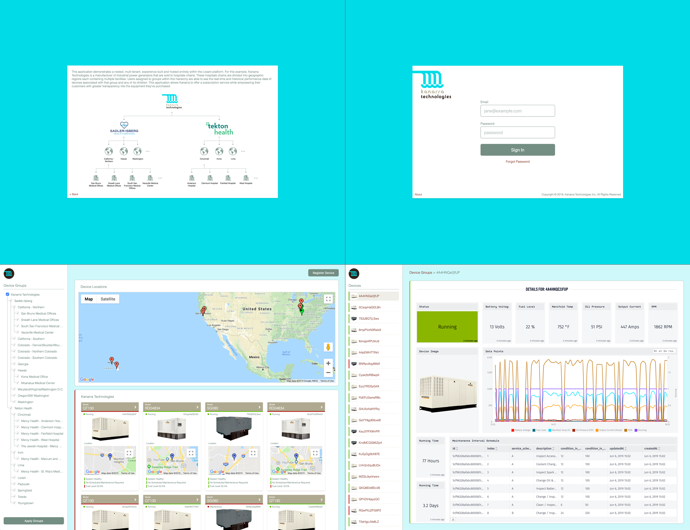

# Example Losant Application - Kanarra Technologies

This application demonstrates a nested, multi-tenant, IoT experience built and hosted entirely within the Losant Enterprise IoT Platform. For this example, Kanarra Technologies is a hypothetical manufacturer of industrial power generators that are sold to hospitals chains. These hospitals chains are divided into geographic regions each containing multiple facilities. Users assigned to groups within this hierarchy are able to see the real-time and historical performance data of devices associated with that group and any of its children. This application allows Kanarra to offer a subscription service while empowering their customers with greater transparency into the equipment they’ve purchased.

## How to Use this Application

This example contains the Losant [Experience](https://docs.losant.com/experiences/overview/), [Workflows](https://docs.losant.com/workflows/overview/), [Files](https://docs.losant.com/applications/files/), [Data Tables](https://docs.losant.com/data-tables/overview/), and [Device Recipes](https://docs.losant.com/devices/device-recipes/) required to implement the complete Kanarra Technologies remote monitoring solution. It is intended to be used as a reference implementation for developers seeking best practices or additional information on how to build a similar project.

## What's in This Repo?

This repository contains several directly importable resources (e.g. Workflows, Data Tables, etc). This repo also contains metadata files that describe the format and content of other resources that are not yet directly importable. You can use these metadata files to manually recreate the resources. The details of each are outlined below.

* `./experience` and `./files`: these directories map directly to the [Losant CLI](https://docs.losant.com/cli/overview/) directory structure and contain the [Pages](https://docs.losant.com/experiences/views/#pages), [Layouts](https://docs.losant.com/experiences/views/#layouts), [Components](https://docs.losant.com/experiences/views/#components), and [Files](https://docs.losant.com/applications/files/) that make up this application's experience.
* `./experience/workflows`: all experience workflows. These can be directly imported into your application to view the implementation.
* `./experience/endpoints.json`: file that describes the Experience Endpoint configuration for this experience.
* `./experiences/groups.json`: file that describes the Experience Groups hierarchy for this experience.
* `./devices/generator.recipe`: the [Device Recipe](https://docs.losant.com/devices/device-recipes/) that describes the devices used in this example application. This can be directly imported into your application.
* `./data-tables`: contain metadata files that describe the format of this application's data tables. Also contains CSV files that contain the required data.
* `./globals.json`: contains the [Application Globals](https://docs.losant.com/applications/overview/#application-globals), which hold configuration values like the Google Maps API key.

---

Copyright (c) 2019 Losant IoT, Inc

https://www.losant.com